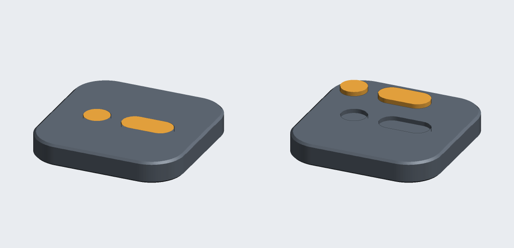

# Plaque Morse Training

L'icône du site, en objet : un carré aux coins arrondis de 35 mm de côté et
5 mm d'épaisseur, portant le point et le trait de la lettre **A** du morse.

La plaque est **pleine** : rien n'est creusé dedans en dehors du logo. La cavité
qu'on voudra y mettre — un logement pour une pastille NFC, un aimant, un lest —
se pose dans le trancheur avec un volume négatif, sans avoir à retoucher le
modèle.

Le logo est une **pièce à part**, exactement à la forme du creux qu'elle
remplit : c'est elle qu'on colore.



Le dessin n'a pas été redessiné à la main : il est transposé du fichier
`public/icons/icon.svg`, à l'échelle près. Les proportions du carré, le rayon
des coins, le diamètre du point, la longueur du trait et l'écart entre les deux
sont exactement ceux de l'icône.

## Cotes

| | |
| --- | --- |
| Encombrement | 35 × 35 × 5 mm |
| Rayon des coins | 7,66 mm (soit 14/64 du côté, comme dans le SVG) |
| Arêtes | chanfrein à 45° de 0,5 mm dessus, 0,4 mm dessous |
| Creux du motif | 1,0 mm, du plan 4,0 mm à la face du dessus |
| Volume | 5,75 cm³ pour le corps, 0,09 cm³ pour le motif |

Le chanfrein de 0,4 mm sous la plaque n'est pas décoratif : il absorbe le pied
d'éléphant, cet évasement des premières couches qui empêche autrement l'objet de
poser à plat. Mettre `CHANFREIN_BAS = 0` dans `genere.py` pour une arête vive.

L'icône penche très légèrement à gauche — le motif y est décalé de 2,25 unités
sur 64. Invisible à 64 pixels, ce décalage se verrait sur 35 mm : le modèle
recentre donc le motif. Pour rester rigoureusement fidèle à l'icône, passer
`CENTRER_MOTIF` à `False` et relancer le script.

## Fichiers

| Fichier | Pour quoi faire |
| --- | --- |
| `plaque-morse.3mf` | **le fichier à ouvrir dans Bambu Studio** — les deux pièces réunies en un seul objet, déjà posées sur le plateau |
| `stl/plaque-morse-corps.stl` | la plaque seule |
| `stl/plaque-morse-motif.stl` | le logo seul |
| `genere.py` | le script qui produit tout ce qui précède |
| `apercu.png` | l'image ci-dessus, calculée par le script |

Le `.3mf` ne contient aucune extension propriétaire : Bambu Studio, Orca,
PrusaSlicer et Cura le lisent tous sans réparation. Il est en millimètres, et la
plaque est posée en (90, 90) — un point qui tombe sur le plateau de n'importe
quelle Bambu, A1 mini comprise.

## Changer la couleur du logo

Le corps et le motif sont deux maillages distincts, réunis en un seul objet.
Bambu Studio et Orca — comme tout ce qui descend de PrusaSlicer — les présentent
donc comme **deux pièces d'un même objet**, solidaires mais réglables
séparément.

**Avec un AMS.** Dans la liste des objets à gauche, déplier *Plaque Morse* :
apparaissent *Corps* et *Motif*. Sélectionner *Motif*, puis choisir son filament
dans la pastille de couleur de la barre d'outils (ou par un clic droit →
*Changer de filament*). Le corps garde le sien. Les couleurs de l'icône sont
`#0B1015` pour le corps et `#FFB545` pour le motif ; elles sont déjà inscrites
dans le `.3mf`. Penser à réduire la tour de purge : il n'y a qu'un millimètre à
changer, tout en haut.

**Sans AMS, avec un changement de filament.** Le motif commence à 4,0 mm, juste
après la 20ᵉ couche en 0,2 mm. Clic droit sur la barre de couches à droite de
l'aperçu, à cette hauteur, *Ajouter un changement de filament* : tout ce qui est
au-dessus sort dans la seconde couleur — le motif, mais aussi la surface autour.

**Sans rien.** Supprimer la pièce *Motif* et n'imprimer que le corps : le point
et le trait restent lisibles, gravés d'un millimètre.

**Incrustation collée.** Pour imprimer le logo à part et le coller ensuite,
mettre `JEU_MOTIF = 0.15` dans `genere.py` et régénérer : le motif est alors
rétréci de 0,15 mm sur tout son contour, ce qui laisse la place à la colle. Tel
qu'il est livré, le jeu est nul — les deux pièces se touchent exactement, ce
qu'il faut pour l'AMS.

## Creuser la plaque soi-même

Clic droit sur *Plaque Morse* dans la liste des objets → *Ajouter une pièce
négative* → un cube ou un cylindre. Il se règle ensuite au millimètre dans le
panneau de droite : dimensions et position, l'origine Z étant le plateau.

Pour une pastille NFC ronde de 25 mm, par exemple : un cylindre de 26 mm de
diamètre et 1,2 mm de haut, posé à Z = 0, laisse 3,8 mm de matière au-dessus,
dont le millimètre du logo. Le PLA est transparent aux ondes de 13,56 MHz, la
pastille se lit des deux côtés. Rien de métallique dans la plaque en revanche,
sous peine de rendre la pastille illisible.

La pièce négative appartient à l'objet entier : elle creuserait aussi le motif
si elle montait jusqu'à lui. En restant sous 4,0 mm, aucun risque.

## Réglages d'impression

Rien d'exotique : la pièce est plate, sans porte-à-faux et sans support.

| | |
| --- | --- |
| Orientation | telle quelle, motif vers le haut, à plat sur le plateau |
| Couche | 0,2 mm — le millimètre du motif tombe alors juste |
| Parois | 3, pour que les flancs soient francs |
| Remplissage | 15 % suffit ; monter à 25 % donne un objet plus lourd en main |
| Supports | aucun |
| Radeau, bord | inutiles, la semelle fait près de 12 cm² |

Une pièce négative ajoutée par le dessous fait apparaître un pont, que la
ventilation d'une Bambu franchit sans difficulté jusqu'à une trentaine de
millimètres.

## Régénérer le modèle

Le script ne dépend que de la bibliothèque standard de Python — ni OpenSCAD, ni
CAO, ni bibliothèque à installer.

```sh
python3 modele-3d/genere.py
```

Tous les réglages tiennent dans le premier bloc de `genere.py` : côté,
épaisseur, chanfreins, profondeur du motif, jeu, finesse des contours. Une
plaque de 50 mm ou une épaisseur de 8 mm ne demandent qu'à changer une ligne.

Le script vérifie ce qu'il produit avant d'écrire quoi que ce soit : chaque
maillage doit être fermé — toute arête parcourue exactement deux fois, une fois
dans chaque sens — sans triangle dégénéré et de volume positif. Si un contrôle
échoue, rien n'est écrit. C'est ce qui garantit qu'aucun trancheur n'aura à
réparer le maillage.
